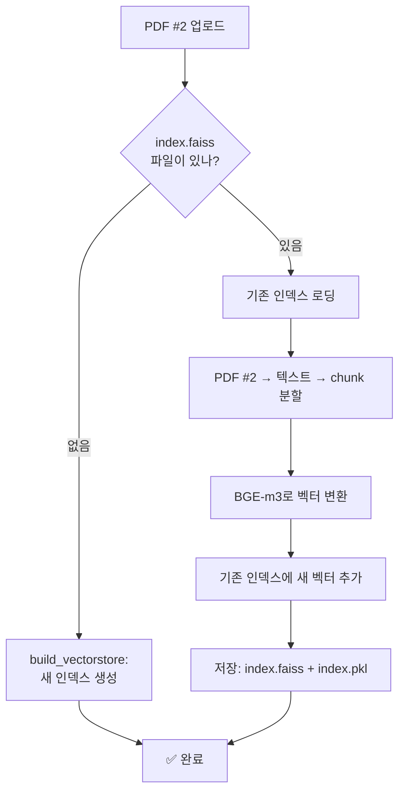

# 📚 PDF Ingestion & Merging 완벽 가이드

> 이 문서는 Research Agent에 PDF를 업로드했을 때 내부에서 어떤 일이 일어나는지
> 초보자도 이해할 수 있도록 단계별로 설명합니다.

---

## 🚀 실행 방법 (Evaluator Guide)

### 사전 요구사항
| 항목 | 비고 |
|------|------|
| Python 3.10+ | 시스템에 설치 |
| Ollama | https://ollama.com 에서 설치 |

### 실행 (PowerShell)

```powershell
# 1. 프로젝트 폴더로 이동
cd research-agent

# 2. 가상환경 생성 및 패키지 설치 (최초 1회)
.venv\Scripts\python.exe -m venv .venv
.venv\Scripts\python.exe -m pip install -r requirements.txt

# 3. Ollama 모델 다운로드 (최초 1회, 인터넷 필요)
ollama pull qwen3.5:4b

# 4. 실행 (Ollama 자동 실행 + Streamlit 실행)
.\run.ps1
```

`run.ps1`이 Ollama를 자동으로 찾아서 실행하고, 필요한 모델이 없으면 자동 다운로드까지 처리합니다.
브라우저가 자동으로 열리지 않으면 http://localhost:8501 로 접속하세요.

> 💡 평가 시 `run.ps1` 한 번만 실행하면 Ollama 실행 → 모델 확인 → Streamlit 실행까지 모두 자동으로 처리됩니다.

---

1. [Ingestion이란?](#1-ingestion이란)
2. [한눈에 보는 전체 흐름](#2-한눈에-보는-전체-흐름)
3. [1단계: PDF 로딩](#3-1단계-pdf-로딩)
4. [2단계: 텍스트 분할 (Chunking)](#4-2단계-텍스트-분할-chunking)
5. [3단계: Embedding (벡터화)](#5-3단계-embedding-벡터화)
6. [4단계: FAISS 인덱스 저장](#6-4단계-faiss-인덱스-저장)
7. [Merge란? (PDF 추가 업로드)](#7-merge란-pdf-추가-업로드)
8. [파일 구조](#8-파일-구조)
9. [자주 묻는 질문](#9-자주-묻는-질문)
10. [성능 팁](#10-성능-팁)

---

## 1. Ingestion이란?

**Ingestion = PDF를 AI가 이해할 수 있는 형태로 가공하는 과정**

컴퓨터는 글자를 "이해"하지 못합니다. 숫자만 이해합니다.
Ingestion은 PDF 속 글자를 → 숫자(벡터)로 변환해서, 나중에 "이 PDF에서 OOO에 관한 내용 찾아줘" 같은 질문에 답할 수 있게 만드는 과정입니다.

```
입력: PDF 파일 (인간이 읽는 문서)
         ↓
    [Ingestion]
         ↓
출력: vectorstore/ 폴더 (AI가 검색하는 데이터)
```

---

## 2. 한눈에 보는 전체 흐름

```
PDF 업로드
    │
    ▼
┌─────────────────────────────────────────────────────┐
│ 1. PDF 로딩 (PyMuPDF)                                │
│    PDF 파일을 열어서 → 페이지별로 텍스트 추출           │
│    소요시간: 0.3초 미만 (보통 11페이지 기준)           │
└─────────────────────────────────────────────────────┘
    │
    ▼
┌─────────────────────────────────────────────────────┐
│ 2. 텍스트 분할 — Chunking                             │
│    긴 문서를 → 768자씩 → 잘게 쪼갬                    │
│    소요시간: 즉시 (0.01초)                              │
│    예: 11페이지 → 약 70개의 chunk                      │
└─────────────────────────────────────────────────────┘
    │
    ▼
┌─────────────────────────────────────────────────────┐
│ 3. Embedding — BGE-m3 모델이 chunk를 → 숫자로 변환     │
│    각 chunk를 → 1024개의 숫자(벡터)로 변환             │
│    소요시간: chunk 10개당 약 6.5초 (CPU 기준)           │
│    70개 기준 전체 약 45초                              │
└─────────────────────────────────────────────────────┘
    │
    ▼
┌─────────────────────────────────────────────────────┐
│ 4. FAISS 인덱스 저장                                  │
│    벡터들을 → FAISS라는 검색엔진에 저장                │
│    vectorstore/index.faiss + index.pkl 파일 생성      │
│    소요시간: 1초 미만                                 │
└─────────────────────────────────────────────────────┘
    │
    ▼
✅ 완료! 이제 질문 가능
```

---

## 3. 1단계: PDF 로딩

**사용 기술:** PyMuPDF (`fitz`)

**하는 일:**
- PDF 파일을 열어서 각 페이지의 텍스트를 추출합니다.
- 페이지 번호, 파일명 등 부가정보(metadata)도 함께 저장합니다.

**코드로 보기:**
```python
documents = load_pdf("data/papers/my_paper.pdf")
# 결과: [Document(page_1), Document(page_2), ..., Document(page_11)]
```

**출력 예시:**
```
문서 1 (page 1):
  내용: "In this paper, we present a novel TCAD simulation..."
  메타: {source: "my_paper.pdf", page: 1}

문서 2 (page 2):
  내용: "The device structure consists of a GAA FET with..."
  메타: {source: "my_paper.pdf", page: 2}
```

**참고:** PDF에 이미지나 표가 많으면 텍스트 추출이 불완전할 수 있습니다.
  이 경우 텍스트 일부가 누락될 수 있습니다.

---

## 4. 2단계: 텍스트 분할 (Chunking)

**사용 기술:** RecursiveCharacterTextSplitter

**왜 필요한가?**
- AI 모델은 한 번에 처리할 수 있는 글자 수에 한계가 있습니다.
- 긴 PDF(10페이지 이상)를 통째로 넣으면 처리 불가능합니다.
- 그래서 적당한 크기로 잘라서(chunk) 여러 조각으로 만듭니다.

**어떻게 자르나?**
```
문장 끝(.) → 문단 끝(\n\n) → 줄바꿈(\n) 순서로
가능한 자연스러운 경계에서 자릅니다.
```

**설정값:**
| 항목 | 값 | 설명 |
|------|-----|------|
| chunk_size | 768 | 한 chunk의 최대 글자 수 |
| chunk_overlap | 50 | chunk 간 겹치는 글자 수 (앞뒤 연결성 유지) |

**예시: 11페이지 TCAD 논문**
```
Page 1 ──────────────────────────────────────┐
                                               │
  Chunk 1: "In this paper, we present..."      │ ← chunk_size=768자
  Chunk 2: "...GAA FET structure with..."      │
  Chunk 3: "...simulation results show..."      │ ← overlap 50자
  ...                                          │
  Chunk 70: "...conclusion and future work."   │
                                               │
총 70개의 chunk로 분할                        ←
```

> 🔑 **chunk_size가 중요한 이유**
> - 너무 작으면(256): 문맥이 끊겨서 검색 품질 저하
> - 너무 크면(1024): 처리 시간 증가, 검색 정밀도 저하
> - **768**: TCAD 기술문서에 적절한 균형값

---

## 5. 3단계: Embedding (벡터화)

**사용 기술:** BAAI/bge-m3 (HuggingFace Embedding Model)

### 5.1 Embedding이란?

글자를 숫자로 바꾸는 과정입니다. 아래 그림처럼:

```
"TCAD simulation of GAA FET"
        ↓ [BGE-m3 모델]
[0.231, -0.543, 0.876, ..., 0.124]  ← 1024개의 숫자
```

이 숫자 묶음을 **벡터(vector)** 라고 부릅니다.
벡터는 문서의 **의미**를 숫자로 압축한 것입니다.

### 5.2 왜 Embedding이 필요한가?

질문("GAA FET의 문턱전압은?")도 같은 방식으로 벡터로 변환합니다.
그리고 모든 chunk 벡터 중에서 질문 벡터와 **가장 가까운**(의미가 비슷한) chunk를 찾습니다.

```
질문 벡터: [0.812, -0.123, ...]
    │
    ▼ 계산: 코사인 유사도 (cosine similarity)
    │
Chunk 5 벡터: [0.801, -0.110, ...] → 유사도 0.95 ✅ (매우 유사)
Chunk 3 벡터: [0.231,  0.456, ...] → 유사도 0.12 ❌ (관련 없음)
Chunk 8 벡터: [0.765, -0.089, ...] → 유사도 0.87 ✅ (유사)
```

### 5.3 Batch Embedding (성능 최적화)

10개의 chunk를 한꺼번에(배치로) 변환하면 훨씬 빠릅니다.

```
단일 처리: chunk 1개당 1.2초 → 70개 = 84초
배치 처리: chunk 10개 묶음 → 10개당 6.5초 → 70개 = 45초 (약 2배 빠름)
```

### 5.4 진행상황 표시 (Progress Bar)

Streamlit 화면에서 실시간 진행률을 보여줍니다:

```
[■■■■■■■■□□□□□□□□□□] 40%  Embedding 28/70 chunks...
```

### 5.5 모델 정보

| 항목 | 값 |
|------|-----|
| 모델명 | BAAI/bge-m3 |
| 크기 | 약 2.2GB (메모리 로딩 시) |
| 파라미터 | 5억 6700만 개 |
| 출력 벡터 크기 | 1024차원 |
| 지원 언어 | 한국어, 영어, 중국어 등 (다국어) |
| 첫 로딩 시간 | 약 9초 (이후 캐시) |

---

## 6. 4단계: FAISS 인덱스 저장

**사용 기술:** FAISS (Facebook AI Similarity Search)

### 6.1 FAISS란?

벡터를 **빠르게 검색**하기 위한 데이터베이스입니다.
수백만 개의 벡터 중에서도 0.01초 안에 가장 유사한 벡터를 찾을 수 있습니다.

### 6.2 저장되는 파일

```
vectorstore/
├── index.faiss   ← FAISS 검색 인덱스 (바이너리, 벡터 데이터)
└── index.pkl     ← 문서 정보 (원본 텍스트 + 메타데이터)
```

- `index.faiss`: 숫자(벡터)만 저장. AI 검색엔진의 핵심.
- `index.pkl`: 원본 글자 저장. 검색 결과를 화면에 표시할 때 사용.

### 6.3 어떻게 검색하나?

```
질문: "What is the threshold voltage?"
    ↓ Embedding (벡터화)
질문 벡터: [0.812, -0.123, ...]
    ↓ FAISS 검색 (0.01초)
상위 5개 chunk 반환:
  Chunk 42: "The threshold voltage of the device is..." (유사도 0.92)
  Chunk 15: "Vth extraction method..."                    (유사도 0.87)
  ...
```

---

## 7. Merge란? (PDF 추가 업로드)

### 7.1 Merge가 필요한 상황

1. 첫 번째 PDF 업로드 → **새로운 FAISS 인덱스 생성**
2. 두 번째 PDF 업로드 → **기존 FAISS 인덱스에 추가 (Merge)**

```
PDF #1 업로드:
    ┌─ FAISS Index ─┐
    │  Chunk 1-70   │  ← 첫 생성
    └───────────────┘

PDF #2 업로드:
    ┌─ FAISS Index ─┐
    │  Chunk 1-70   │  ← 기존 유지
    │  Chunk 71-140 │  ← 새로 추가 (Merge)
    └───────────────┘
```

### 7.2 Merge 과정 상세



### 7.3 Merge의 특징

- 기존 데이터는 **절대 삭제되지 않습니다.**
- 새 PDF의 chunk만 추가됩니다.
- 총 벡터 수가 계속 늘어납니다.
- 한 번 생성된 벡터는 변경되지 않습니다.

```
PDF 1개:    70 벡터
PDF 2개:   140 벡터
PDF 5개:   350 벡터
PDF 10개:  700 벡터
```

### 7.4 Merge 시 주의사항

- **중복 검사 없음:** 같은 PDF를 두 번 업로드하면 같은 내용이 중복 저장됩니다.
- **삭제 불가:** FAISS는 개별 벡터 삭제를 지원하지 않습니다.
  (실수로 잘못 업로드했다면 `vectorstore/` 폴더를 통째로 지우고 처음부터 다시 시작해야 합니다)
- **속도 유지:** 벡터 수가 10만 개가 넘어도 검색 속도는 0.01초를 유지합니다.

---

## 8. 파일 구조

```
research-agent/
│
├── app.py                    ← Streamlit 실행 파일 (웹 UI)
│
├── src/
│   └── ingest.py             ← Ingestion 핵심 코드
│
├── vectorstore/              ★ 저장소 (가장 중요!)
│   ├── index.faiss           ← FAISS 벡터 인덱스
│   └── index.pkl             ← 문서 메타데이터
│
├── data/
│   └── papers/               ← 업로드한 PDF 원본 파일들
│       ├── paper1.pdf
│       └── paper2.pdf
│
├── logs/
│   └── app.log               ← 실행 로그 (오류 추적용)
│
└── .venv/                    ← Python 가상환경 (건드리지 마세요)
```

---

## 9. 자주 묻는 질문

### Q1: PDF 업로드 후 "Ingestion failed" 오류가 뜨면?

대부분 다음 중 하나입니다:
1. **파일이 안 열림** → PDF가 손상되었거나 암호가 걸려 있음
2. **모델 로딩 실패** → 인터넷 연결 확인 (BGE-m3 모델 다운로드 필요)
3. **캐시 문제** → Streamlit 재시작 + `__pycache__` 삭제

### Q2: PDF를 삭제하고 싶어요.

FAISS는 개별 데이터 삭제를 지원하지 않습니다.
전체를 다시 시작해야 합니다:
```powershell
# 1. 기존 저장소 삭제
Remove-Item -Recurse -Force vectorstore

# 2. data/papers 에서 삭제할 PDF 제거
Remove-Item "data\papers\삭제할파일.pdf"

# 3. 앱 재시작
.venv\Scripts\python.exe -m streamlit run app.py
```

### Q3: ingestion이 너무 오래 걸려요.

예상 소요시간 (11페이지 TCAD 논문 기준):

| 상황 | 시간 |
|------|------|
| 첫 번째 PDF (모델 로딩 포함) | ~55초 |
| 두 번째 PDF 이후 (모델 캐시됨) | ~45초 |
| 매우 긴 PDF (50페이지) | ~3분 |

**팁:** CPU만 사용합니다. GPU가 있으면 10배 이상 빨라집니다.

### Q4: "Wrong module loaded" 오류가 뜨면?

Streamlit 캐시 문제입니다 (`__pycache__` 폴더).

```powershell
# 모든 Python 프로세스 종료
taskkill /F /IM python.exe

# 모든 캐시 삭제
Get-ChildItem -Path "." -Recurse -Directory -Filter "__pycache__" | Remove-Item -Recurse -Force

# 잠시 대기 후 재시작
Start-Sleep -Seconds 2
.venv\Scripts\python.exe -m streamlit run app.py
```

### Q5: PDF는 어디에 저장되나요?

`data/papers/` 폴더에 원본 PDF가 보관됩니다.
Ingestion이 완료된 후에도 원본 PDF는 그대로 남아 있습니다.

---

## 10. 성능 팁

### 10.1 현재 속도 (Windows CPU, Intel Iris Xe 기준)

| 단계 | 소요시간 |
|------|---------|
| PDF 로딩 (11페이지) | 0.3초 |
| Chunk 분할 | 즉시 |
| Embedding 모델 로딩 | 9초 (최초 1회) |
| Embedding (chunk 1개) | 0.65초 (batch) |
| Embedding (70개 전체) | ~45초 |
| FAISS 저장 | 0.5초 |
| **총합 (최초)** | **~55초** |
| **총합 (이후)** | **~46초** |

### 10.2 느리다면? 개선 옵션

| 방법 | 효과 | 설명 |
|------|------|------|
| chunk_size 증가 | 빠름↑/정확도↓ | 768→1024: chunk 수 20% 감소 |
| 경량 모델 교체 | 빠름↑/품질↓ | BGE-m3→e5-small: 4배 빠름 |
| GPU 사용 | 매우 빠름↑ | NVIDIA GPU 있으면 10~20배 속도향상 |
| Embedding 캐시 | 반복시 빠름 | 동일 chunk 재처리 skip |

---

> 💡 **Tip:** ingestion이 완료되면 Streamlit 화면 하단에
> "Vector store now contains N vectors" 메시지가 표시됩니다.
> 이 숫자가 늘어나는 것으로 정상 작동을 확인할 수 있습니다.
